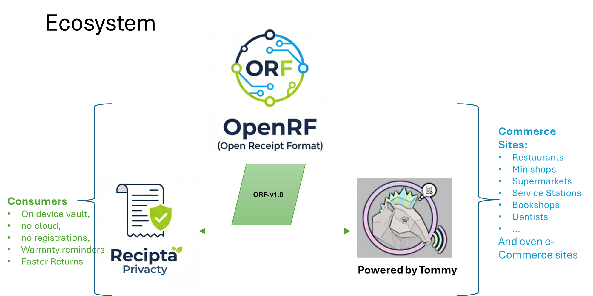
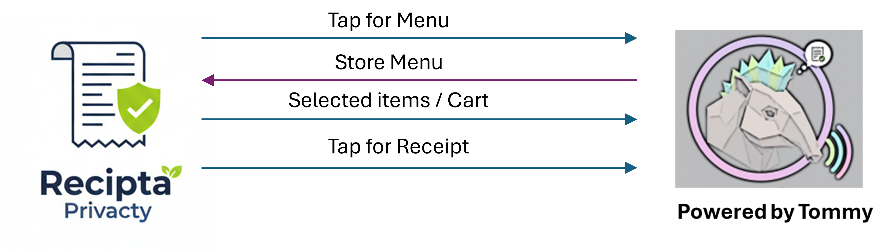

# recipta
Consumer side reference app in the OFR ecosystem

# Recipta

Recipta is an open-source, **local-first receipt vault** designed to store, manage, and analyze digital receipts that conform to the **Open Receipt Format (ORF)**.

All receipts are stored **on the user’s device**.  
There is **no cloud sync by default**.

Recipta exists to give individuals long-term, private access to their receipts — independent of merchants, email inboxes, or platforms.

---

## Core Principles

### 1. Local-Only by Default

- Receipts are stored on-device
- No background uploads
- No third-party analytics
- No account required

Cloud sync or export is **explicitly opt-in** and user-controlled.

---

### 2. ORF-Native Storage

Recipta stores receipts as:
- Canonical ORF JSON
- Optional rendered views (HTML / PDF)

This ensures:
- Portability
- Longevity
- Vendor independence

---

### 3. Claim-Based Ingestion

Recipta does not scrape inboxes or intercept payments.

Receipts enter Recipta via:
- NFC / QR receipt claims (e.g. from Tommy the Tapir)
- Receipt URLs
- File import (ORF JSON)

The user always initiates ingestion.

---

## Relationship to Other Projects

### Open Receipt Format (ORF)

- ORF defines the receipt data model
- Recipta consumes ORF receipts without modification
- Recipta does not extend or alter the ORF schema

### Tommy the Tapir

- Tommy is a reference framework for issuing and claiming receipts
- Recipta is a reference application for storing and using them
- Either can be used independently

---

## What Recipta Can Do

### Receipt Management
- View and search receipts
- Filter by:
  - Merchant
  - Date range
  - Amount
  - Category
- Validate ORF conformance

### Analysis (User-Initiated)
- Generate expense summaries
- Create budget journals
- Produce exportable reports

### AI-Assisted Insights (Optional)
If explicitly enabled by the user, Recipta can:
- Analyze receipts locally or via user-approved AI services
- Generate:
  - Expense reports
  - Spending insights
  - Period summaries

No receipt data is shared without consent.

---

## What Recipta Does Not Do

- No payment processing
- No bank integration
- No automatic cloud backups
- No merchant tracking
- No advertising
- No data resale

Recipta is a **personal data tool**, not a platform.

---

## High-Level Architecture

All operations occur on-device unless explicitly authorized.

---

## Privacy Model

- All receipt data belongs to the user
- Analysis is pull-based, not push-based
- Exports are:
  - Time-bound
  - Filtered
  - Revocable

Recipta follows a principle of **minimum data movement**.

---

## Project Status

Recipta is an **early-stage reference application**.

Current focus:
- Storage model
- ORF ingestion
- Privacy guarantees
- Analysis workflows

Implementation details will evolve as interfaces stabilize.

---

## Contributing

Recipta welcomes contributions from:
- Privacy engineers
- Mobile developers
- UX designers
- Standards contributors

Design discussion is encouraged before major implementation work.

---

## License

This project is open source.  
See the LICENSE file for details.
